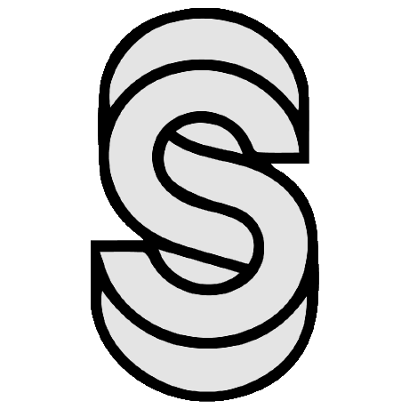

# Pull Request Size 

[](https://opensource.org/licenses/MIT)
[](https://sentry.io)
[](https://github.com/noqcks/pull-request-size/actions)
[](https://codecov.io/gh/noqcks/pull-request-size)
[](https://dependabot.com/)

Pull Request Size is a GitHub App that applies `size/*` labels to Pull Requests based on the total lines of code changed (additions and deletions).


## Install

👉 **Install via [GitHub marketplace](https://github.com/marketplace/pull-request-size/)** 🌟

_This app is free to use for personal and public organization repos. There is a paid plan for
use with private organization repos._

## Sizing

| Name | Description |
| ---- | ----------- |
| <a id="size/XS" href="#size/XS">`size/XS`</a> | Denotes a PR that changes 0-9 lines. |
| <a id="size/S" href="#size/S">`size/S`</a> | Denotes a PR that changes 10-29 lines. |
| <a id="size/M" href="#size/M">`size/M`</a> | Denotes a PR that changes 30-99 lines. |
| <a id="size/L" href="#size/L">`size/L`</a> | Denotes a PR that changes 100-499 lines. |
| <a id="size/XL" href="#size/XL">`size/XL`</a> | Denotes a PR that changes 500-999 lines. |
| <a id="size/XXL" href="#size/XXL">`size/XXL`</a> | Denotes a PR that changes 1000+ lines. |

Pull Request Size calculates the size of a PR as

```
total additions + total deletions - (all generated¹ file additions/deletions)
```

¹ A generated file is either one of the standard generated files as defined in [noqcks/generated](https://github.com/noqcks/generated/blob/master/lib/generated.js) or defined with `linguist-generated=true` in a `.gitattributes` file.

## Billing Issues


When an invoiced GitHub account tries to sign up for a subscription to Pull Request Size via the GitHub Marketplace they are met with the following message: "Unfortunately, invoiced customers cannot purchase paid plans on the Github Marketplace."

To get around GitHub billing limitations, we also offer payment via Stripe invoicing. Please follow these steps to complete:

1. Sign up for the Free plan on the [GitHub Marketplace listing](https://github.com/marketplace/pull-request-size)
2. Send an email to benji@093b.org with a `company name`, `email of a billing contact`, and the `name of your GitHub Organization`. Please indicate whether you would like a yearly or monthly invoice.
3. Once the Stripe invoice has been paid, you will be added to Pro plan.

## Configuration

This app requires no configuration out of the box. However, you can exclude certain files
from being counted towards a PR's size, and you can add custom labels in Github.

### Excluding Files

If you have files that you would not like to be included in the calculation for a Pull Request's size, you can modify the `.gitattributes` file with the flag `linguist-generated=true` on your file or file pattern.

For example to mark all `.meta` files as generated, add this line to `.gitattributes`

```gitattributes
*.meta linguist-generated=true
```

A `.gitattributes` file uses the same rules for matching as `.gitignore` files. See [GitHub documentation](https://docs.github.com/en/github/administering-a-repository/managing-repository-settings/customizing-how-changed-files-appear-on-github) on the linguist-generated flag for more info.

### Custom Labels

You can set custom label names and colors by checking in the file `.github/labels.yml` to every repository you'd like to customize

```yaml
XS:
  name: size/XS
  lines: 0
  color: 3CBF00
S:
  name: size/S
  lines: 10
  color: 5D9801
M:
  name: size/M
  lines: 30
  color: 7F7203
L:
  name: size/L
  lines: 100
  color: A14C05
XL:
  name: size/XL
  lines: 500
  color: C32607
XXL:
  name: size/XXL
  lines: 1000
  color: E50009
```

### Size Comments

Size Comments are comments made on the size of a pull request. By default, Pull Request Size
will not add any comments to a pull request. However, you can enable comments by adding
a comment to a label in the `.github/labels.yml` file.

Any comment that is not empty will be added to the pull request. Leave this key empty
to disable comments for a size.

```yaml
XXL:
  name: size/XXL
  lines: 1000
  color: E50009
  comment: |
    # Whoa! Easy there, Partner!
    This PR is too big. Please break it up into smaller PRs.
```

## Feedback, suggestions and bug reports

Please create an issue here: https://github.com/noqcks/pull-request-size/issues

## License

[MIT](LICENSE) © 2022 Benji Visser <benji@093b.org>

